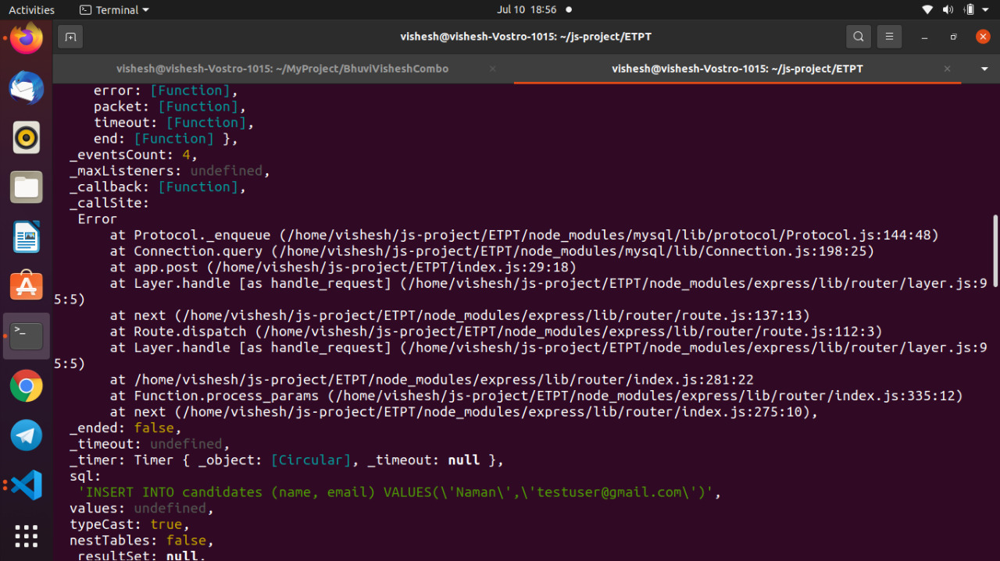

# excellenceTechTest
This is a submission of my test question to Excellence Technologies PVT LTD

In this project i'm using mongodb for database purpose  i created a single table with column id, Student_name, student_email, first_round_test_score, 
second_round_test_score, third_round_test_score

With the help of nodejs and framework express created a end point for adding details of students 
For add a new student in database we use a '/student' and sending a json format data like below 

{
    "name": "Ram",
    "email": "ramdixit@gmail.com",
    "first_round": 8,
    "second_round": 7,
    "third_round": 10
}

After hit the end point with this format data we got a response like below

{
  "_id": "60eb0d16d7727e94fe4c5736",
  "name": "Ram",
  "email": "ramdixit@gmail.com",
  "first_round": 8,
  "second_round": 7,
  "third_round": 10,
  "__v": 0
}

The add student record is completed then we need to two more things to do get a maximum scored student and average of all round of test let see it.

For find the maximum scored student data we have to hit the end point '/students/max-score' and when we hit request this end ponit we got a response with 

{
  "name": "Vikas",
  "scored": 30
}

Well done! we got a maximum scored student whose name is Vikas and he got all 30 points in test congrats Vikas.

Now we have to find average number of students in every round let see the performance the students
For find that details we have to hit request to the end point '/students/avg-scores' and lets see what we got in response 

{
  "first_round_avg": [
    {
      "_id": null,
      "Student": 8.666666666666666
    }
  ],
  "second_round_avg": [
    {
      "_id": null,
      "Student": 8.666666666666666
    }
  ],
  "third_round_avg": [
    {
      "_id": null,
      "Student": 9.666666666666666
    }
  ]
}

We got a response with a json of every test round average score we did it.

Lets see we need to see all students in my database for that we request a en point '/students' with GET method and thesponse we got is
[
  {
    "_id": "60e9fdbb8ace4336617805eb",
    "name": "DOn",
    "email": "don@gmail.com",
    "first_round": 8,
    "second_round": 9,
    "third_round": 9,
    "__v": 0
  },
  {
    "_id": "60eaa08e3e8bb211ad6d8198",
    "name": "Vikas",
    "email": "vikas@gmail.com",
    "first_round": 10,
    "second_round": 10,
    "third_round": 10,
    "__v": 0
  },
  {
    "_id": "60eb0d16d7727e94fe4c5736",
    "name": "Ram",
    "email": "ramdixit@gmail.com",
    "first_round": 8,
    "second_round": 7,
    "third_round": 10,
    "__v": 0
  }
]

Now Excellence Technologies i'm firstly using MySQL and creating two table one for students with column name student_id, student_name, student_email ans second
table for store information of test round with column name test_id, first_round, second_round, third_round but when i tried to send response back its crash 
my server i tried so many think those didn't solve my problem so after destroying whole day i decided to do it with mongoDB but i don't know nothing about 
mongoDb but i caught uo with the docs and done it this way.

i'm encounter with this error if you know solution about this please let me know

My code

